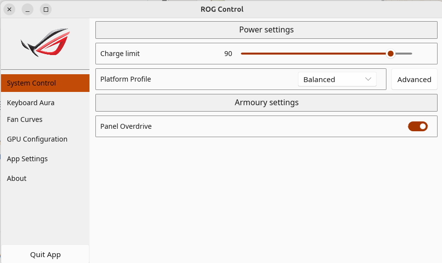
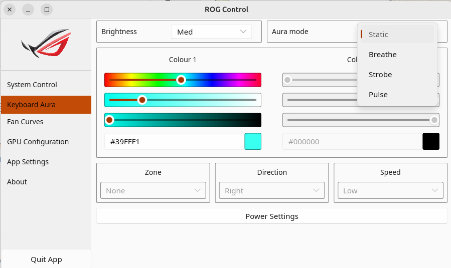
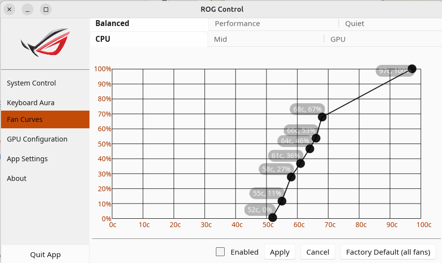
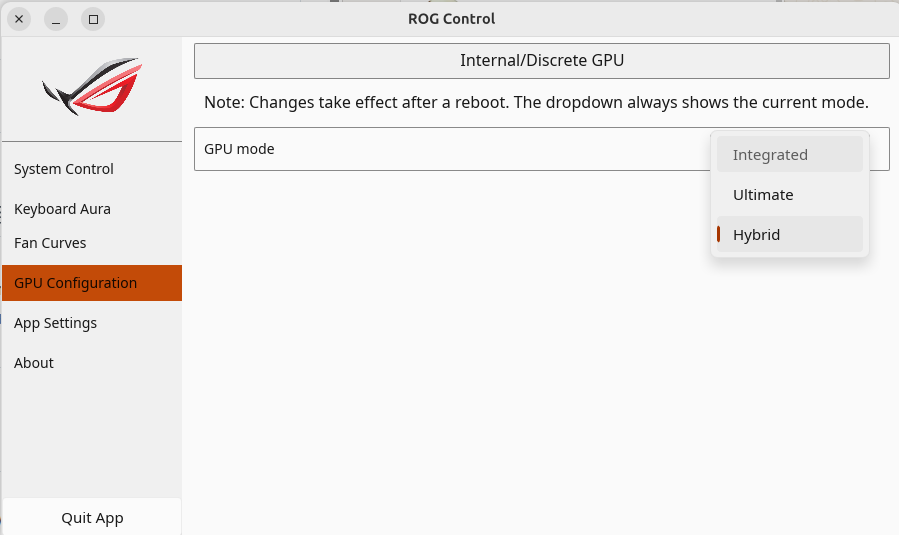
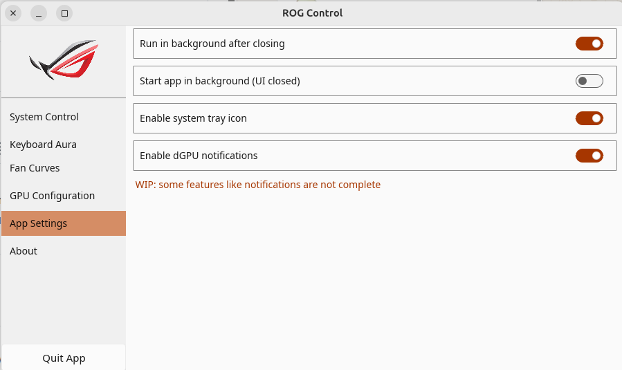

# asusd-supergfxd-installer


Instalador de binarios precompilados para **asusd** y **supergfxd** en laptops ASUS gaming con Linux (Ubuntu/Debian).

Un solo script instala los daemons, servicios systemd, reglas udev, permisos D-Bus y la GUI ROG Control Center — sin necesidad de compilar ni añadir PPAs externos.

## ¿Qué son asusd y supergfxd?

| Daemon | Qué hace |
|---|---|
| **asusd** | Daemon principal ASUS: controla perfiles de rendimiento, límite de batería, teclado RGB (Aura), pantalla AniMatrix y eventos de hardware |
| **supergfxd** | Daemon de GPU switching: alterna entre Intel integrada, modo Hybrid y NVIDIA exclusivo sin reinstalar drivers |

## Versiones incluidas

| Componente | Versión | Fuente |
|---|---|---|
| asusctl / asusd / rog-control-center | 6.3.7 | https://gitlab.com/asus-linux/asusctl |
| supergfxctl / supergfxd | 5.2.7 | https://gitlab.com/asus-linux/supergfxctl |

**Compilado en:** ASUS TUF F16 (FX607VJ), Intel Core 5 210H, Ubuntu 26.04 LTS, kernel 7.0.0-15-generic, x86\_64
**Compatibilidad:** cualquier x86\_64 con Ubuntu 22.04+ / Debian 12+

---

## Compatibilidad

Los binarios son ejecutables ELF x86_64 compilados desde código Rust. Funcionan en **cualquier distribución Linux x86_64 con systemd y glibc compatible** — no son exclusivos de Debian/Ubuntu.

| Distribución | Compatible | Notas |
|---|---|---|
| Ubuntu 22.04 / 24.04 / 26.04 | ✓ | probado |
| Kubuntu / Pop!\_OS / Mint / Zorin | ✓ | basadas en Ubuntu |
| Debian 12+ | ✓ | compatible |
| Fedora 40+ | ✓ | glibc reciente |
| Arch / Manjaro / EndeavourOS | ✓ | rolling, siempre actualizado |
| openSUSE Tumbleweed | ✓ | rolling |
| openSUSE Leap | depende | verificar versión de glibc |
| ARM64 (Raspberry Pi, Mac M1) | ✗ | arquitectura diferente |

> **Nota:** Las instrucciones de dependencias usan `apt` (Debian/Ubuntu). En otras distros sustituir por el gestor de paquetes correspondiente: `dnf` en Fedora, `pacman` en Arch, `zypper` en openSUSE.

Si los binarios no arrancan en tu sistema, compílalos directamente desde `build/` — ver sección **Recompilar desde fuente**.

---

## Hardware soportado

Laptops ASUS con `asus-nb-wmi` en el kernel:

- ROG (Strix, Zephyrus, Flow, Scar)
- TUF Gaming
- ProArt Studiobook
- Vivobook Pro / S

Para GPU switching (supergfxd) se requiere dGPU NVIDIA.

---

## Requisitos previos

```bash
# Driver NVIDIA (ajustar versión según kernel)
sudo apt install nvidia-driver-595

# Dependencias de runtime
sudo apt install libudev1 libgcc-s1
```

Kernel mínimo:
- `5.17+` para funciones básicas
- `6.1+` para control de batería y perfiles avanzados
- `6.19+` para control TDP (Raptor/Meteor Lake)

---

## Instalación

```bash
chmod +x instalar.sh
./instalar.sh
```

El script realiza 6 pasos automáticamente:

1. Instala los binarios del sistema en `/usr/bin/`
2. Instala los servicios systemd
3. Instala las reglas udev y permisos D-Bus
4. Instala los datos de aplicación (layouts RGB, AniMatrix)
5. Instala ROG Control Center con entrada en el menú del sistema
6. Habilita e inicia los servicios

---

## Estructura del repositorio

```
asusd-supergfxd-installer/
├── instalar.sh             ← script de instalación automática
├── binarios/               ← ejecutables precompilados (x86_64)
│   ├── asusd               daemon principal ASUS
│   ├── asusctl             CLI para controlar asusd
│   ├── asusd-user          daemon de sesión de usuario
│   ├── asus-shutdown       manejador de apagado
│   ├── rog-control-center  GUI gráfica (GTK3, Wayland)
│   ├── supergfxd           daemon de GPU switching
│   └── supergfxctl         CLI para cambiar modo GPU
├── servicios/              ← units de systemd
│   ├── asusd.service
│   ├── asus-shutdown.service
│   └── supergfxd.service
├── configs/                ← configuración de sistema
│   ├── asusd.conf                    permisos D-Bus para asusd
│   ├── org.supergfxctl.Daemon.conf   permisos D-Bus para supergfxd
│   ├── asusd.rules                   regla udev (auto-inicia asusd)
│   ├── 90-supergfxd-nvidia-pm.rules  power management NVIDIA
│   └── 90-nvidia-screen-G05.conf     xorg config para ASUS
├── datos/                  ← datos de aplicación
│   ├── aura_support.ron    layouts de teclados RGB soportados
│   └── anime/              animaciones para pantalla AniMatrix
└── build/                  ← código fuente (para recompilar)
    ├── asusctl/
    └── supergfxctl/
```

---

## Uso básico

### ROG Control Center (GUI)

```bash
rog-control-center
```

### GPU switching

```bash
supergfxctl -g                       # ver modo actual
supergfxctl -m Integrated            # solo Intel (máxima batería)
supergfxctl -m Hybrid                # Intel + NVIDIA on-demand (recomendado)
supergfxctl -m NvidiaNoModeset       # NVIDIA exclusivo (máximo rendimiento)
```

### Perfiles de rendimiento

```bash
asusctl profile -l          # listar perfiles
asusctl profile -p Balanced # aplicar perfil
```

### Control de batería

```bash
asusctl -c 80   # limitar carga al 80%
```

### Teclado RGB

```bash
asusctl aura -e static --red 255 --green 0 --blue 0
asusctl aura -e breathe
asusctl aura -e off
```

---

## Recompilar desde fuente

Si los binarios no son compatibles con tu sistema:

```bash
sudo apt install rustup build-essential cmake clang \
    libclang-dev libudev-dev libfontconfig-dev \
    libxkbcommon-dev libgtk-3-dev

rustup default stable

cd build/asusctl
cargo build --release --locked

cd ../supergfxctl
cargo build --features "daemon cli" --release

cd ../..
./instalar.sh
```

---

## Desinstalar

```bash
sudo rm /usr/bin/{asusd,asusctl,asusd-user,asus-shutdown,rog-control-center,supergfxd,supergfxctl}
sudo rm /usr/lib/systemd/system/{asusd,asus-shutdown,supergfxd}.service
sudo rm /usr/lib/udev/rules.d/{99-asusd,90-supergfxd-nvidia-pm}.rules
sudo rm /usr/share/dbus-1/system.d/{asusd.conf,org.supergfxctl.Daemon.conf}
sudo rm /usr/share/applications/rog-control-center.desktop
sudo rm -rf /usr/share/asusd
sudo systemctl daemon-reload
```

---

## Solución de problemas

### asusd no arranca

```bash
journalctl -u asusd -b --no-pager | tail -30
```

Causa común: falta `/etc/asusd/` — se crea automáticamente en el primer arranque.

### supergfxd no arranca

```bash
sudo systemctl enable supergfxd.service
sudo systemctl start supergfxd.service
```

### Pantalla negra después de cambiar GPU

Desde Live USB, restaurar modo Integrated:

```bash
sudo mount /dev/nvme0n1p5 /mnt
sudo mount --bind /dev /mnt/dev
sudo mount --bind /proc /mnt/proc
sudo mount --bind /sys /mnt/sys
sudo chroot /mnt

cat > /etc/asusd/supergfxd.conf << 'EOF'
{"mode":"Integrated","vfio_enable":false,"vfio_save":false,"always_reboot":false,"no_logind":false,"logout_timeout_s":180}
EOF

exit && sudo reboot
```

### Servicios no sobreviven al reboot

`asusd` se activa por udev al detectar hardware ASUS — no necesita `enable`.
`supergfxd` sí necesita estar habilitado: `sudo systemctl enable supergfxd.service`

---

## Capturas de pantalla

| System Control | Keyboard Aura |
|---|---|
|  |  |

| Fan Curves | GPU Configuration |
|---|---|
|  |  |



---

## Licencia

MIT License — Copyright (c) 2026 **roothec**

Ver [LICENSE](LICENSE) para el texto completo.

---

## Autor

Creado por **[roothec](https://github.com/roothec)**
Compilado y probado en ASUS TUF Gaming F16 (FX607VJ) — Ubuntu 26.04 LTS, kernel 7.0.0-15-generic.
